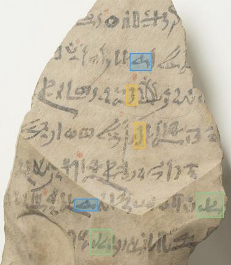

Cet article a été initialement publié le 04/03/2021 dans [Archeologia Magazine](https://www.archeologia-magazine.com/numero-596/egypte-dernieres-decouvertes/egypte-dernieres-decouvertes.53184.php#article_53184), magazine payant d'archéologie.

<!--truncate-->

.

**Mettre les images avec les légendes.**

.

---

# CLASSIFICATION DES MAINS DE SCRIBES ASSISTÉE PAR L’INTELLIGENCE ARTIFICIELLE

**Depuis 2019, L’Ifao et Sorbonne Université mènent conjointement un programme de recherches (ÉCRITURES – Pour une archéologie et une anthropologie des écritures de l’Égypte ancienne) afin de mieux comprendre les usages des différentes graphies égyptiennes et les acteurs impliqués. Si les textes de la vie courante (administration, lettres, littérature, sciences, textes magiques et rituels) étaient inscrits en hiératique, l’écriture principale des scribes égyptiens, une cursive dérivée des hiéroglyphes, ces derniers demeuraient limités à des usages monumentaux et sacrés.**

 

Exemple de signes annotés sur l’ostracon IFAO 117 rédigé de la main du scribe Amennakhte. © Ifao.

# Identifier les mains pour connaître les lettrés
<!-- IDENTIFIER LES MAINS POUR CONNAÎTRE LES LETTRÉS -->

Les scribes, les auteurs et plus généralement les praticiens de l’écriture en Égypte ancienne, restent mal connus d’autant que leurs manuscrits sur papyrus ou sur ostraca (tessons de poterie ou morceaux de calcaire taillés inscrits) furent le plus souvent anonymes. Une des tâches des égyptologues consiste donc à examiner les styles individuels d’écriture pour rapprocher entre eux des documents issus d’une même main. Les outils de la paléographie aident à établir des comparaisons entre la forme de certains signes afin de regrouper des textes possiblement tracés par une même personne. Mais les caractéristiques à prendre en compte sont nombreuses (forme générale du signe, nombre de traits, taille, dynamisme de l’écriture, mise en page, régularité...) et constituent autant d’aspects difficiles à combiner et à comparer, pour l’œil et l’esprit humains, lorsque le nombre de documents se multiplie. 

# L'apport du Deep Learning
<!-- L’APPORT DU DEEP LEARNING -->

C’est là que les outils d’intelligence artificielle, habilement mis en œuvre, peuvent s’avérer décisifs. Ce programme de recherche s’est donc associé au Sorbonne Centre of Artificial Intelligence et à datacraft afin explorer les solutions que le deep learning (ou réseau de neurones) peut apporter. Une première

expérience a ainsi été montée à partir de documents de scribes de l’époque ramesside (XIII e -XI e siècles avant notre ère). Des jeux de données provenant du British Museum, du Museo Egizio de Turin et de l’Institut français d’archéologie orientale, constitués de photos numériques d’ostraca et de papyrus publiés, ont été collectés. Réalisée avec l’équipe Data science de Vinci Autoroutes qui travaille régulièrement avec datacraft, une étape de préparation des données a été nécessaire avant de présenter ces images numériques au réseau de neurones. Grâce au logiciel de Vinci, les égyptologues ont annoté les documents dont les scribes-rédacteurs étaient connus avec certitude. Il fut ensuite possible de classer automatiquement les images non-annotées grâce au réseau de neurones, ce dernier identifiant si telle ou telle image appartient à une main déjà connue. Une autre voie explorée se fonde plus directement sur les signes égyptiens utilisés dans les documents non classés. Elle consiste à utiliser le réseau de neurones pour regrouper les textes dont les signes d’une écriture similaire, ce qui permettra à terme d’identifier de nouveaux scribes potentiels…

**Chloé Ragazzoli**, Sorbonne Université, **Florence Albert**, Ifao, **Xavier Lioneton**, datacraft, **Amir Nakib**, Vinci, dans le cadre d’une collaboration au sein du club datacraft